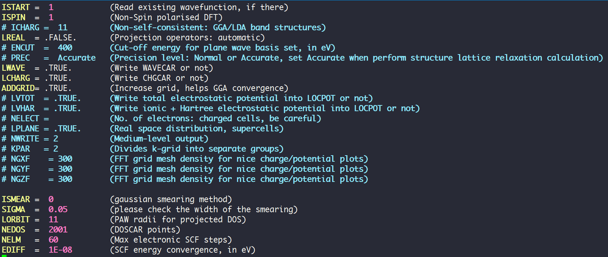
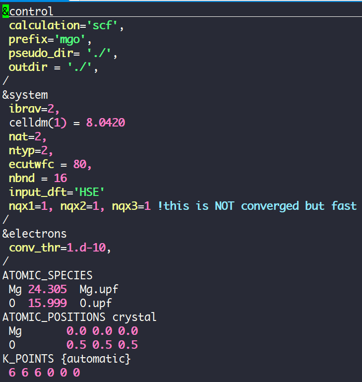
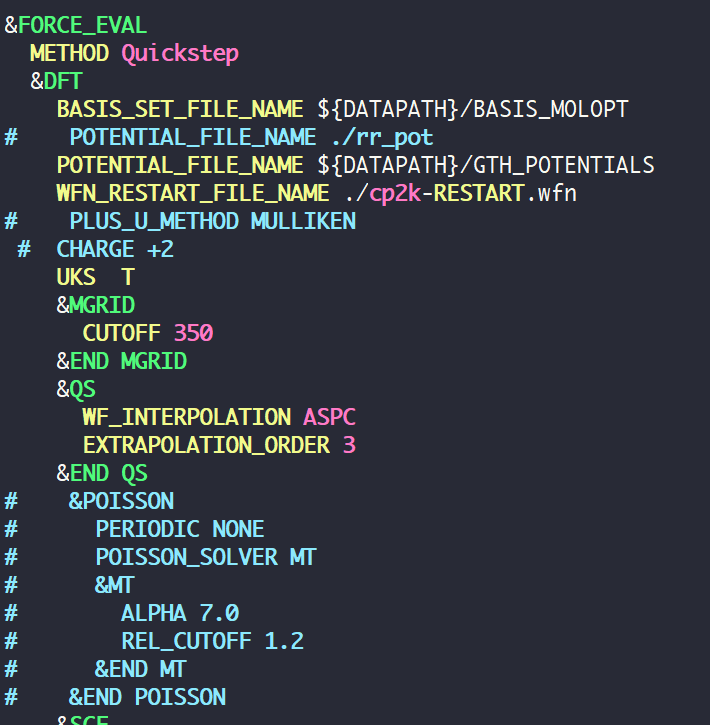
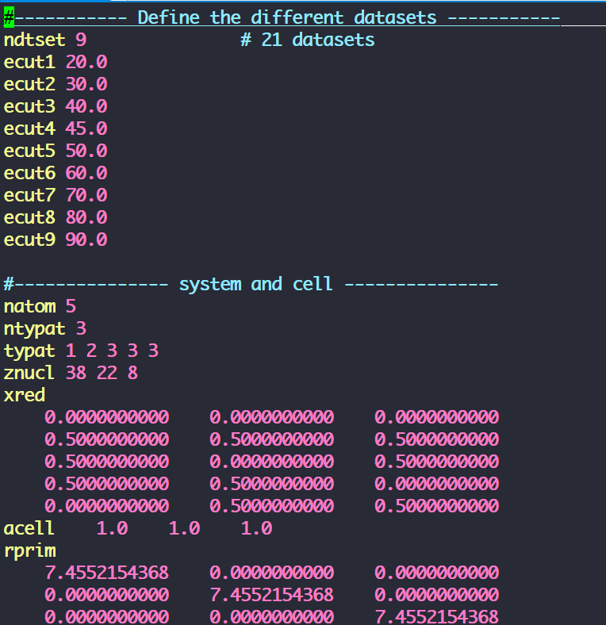

## vim files

Syntax highlighting for Qquantum Espresso, ABINIT, VASP, and CP2K. 

**1.Qquantum Espresso:**

https://github.com/leseixas/quantum_espresso-vim

**2.ABINIT:**

https://github.com/Lattay/abinit.vim

**3.VASP:**

https://github.com/Lattay/vasp.vim

**4.CP2K:**

https://github.com/cp2k/vim-cp2k


## How to use

First, download the `autoload.tar.gz` file, put this file in the directory `~/.vim `

```
—> ~ cd ~/.vim
autoload
—> ~ pwd
/vol01/homes/hy8493/.vim
—> ~ cd autoload/
abinit.vim  plug.vim  quantum_espresso-vim  vasp.vim  vim-cp2k
```
Second, copy the following content to your `.vimrc`, for examples, `vi ~/.vimrc`.
```
call plug#begin('~/.vim/autoload')
Plug 'Lattay/abinit.vim'
Plug 'Lattay/vasp.vim'
Plug 'cp2k/vim-cp2k'
Plug 'leseixas/quantum_espresso-vim'
call plug#end()
```

https://github.com/junegunn/vim-plug

## snapshoot for syntax highlighting





